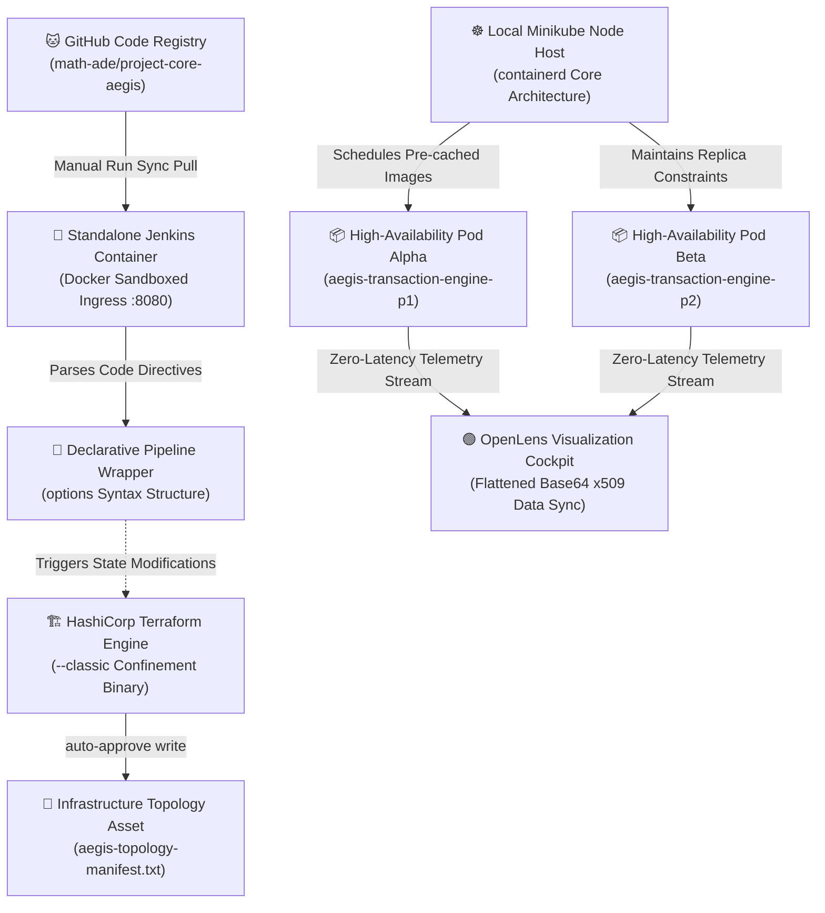

# 📖 DEV_PLATFORM SYSTEMS ARCHITECTURE & INTERVIEW BRIEFING DOSSIER
**Project Engine:** Enterprise GitOps Core Banking Delivery Mesh Grid Topology
**System Engineer:** Adetunji Mathew Babatunde
**Compiled Timestamp:** Tuesday, September 15, 2026

---

## 🗂️ 1. AUTOMATION RUNTIME COMMAND REGISTRY LOGS
Use this exact, ordered command checklist inside your **Ubuntu Linux Terminal** to cleanly restore the entire network stack from scratch following a system reboot, completely bypassing broken or unstable internet proxy tunnels:

```bash
# A. WAKE UP SYSTEM KERNEL SOCKET DAEMONS
sudo service docker start

# B. IGNITE THE REPLICA NODE CLUSTER
minikube start --driver=docker

# C. START THE SANDBOXED CI/CD LOGIC CONTAINER CONTEXT
docker start jenkins

# D. SYNC THE LIVE DEPLOYMENT WORKLOAD CACHE FILE
minikube kubectl -- apply -f ~/aegis-app.yaml

# E. PROVISION IMMUTABLE INFRASTRUCTURE MANIFESTS VIA IACO
# Bypasses the D-Drive partition permissions blocks by pulling files natively from home spaces
cp "/mnt/d/ci cd project/main.tf" ~/project-core-aegis/
terraform init
terraform apply -auto-approve
```

---

## 🎙️ 2. PRODUCTION-TIER TECHNICAL INTERVIEW PREPARATION SHEETS
*Use these proven, architectural talking points during your upcoming technical screens to demonstrate real-world infrastructure problem-solving competence.*

### Q1: How do you resolve cross-OS x509 certificate path incompatibilities between a Windows GUI tool and a Linux VM backend?
> **Answer:** Standard local cluster initialization routines write absolute file system path pointers (e.g., `/home/user/.minikube/...`) directly into the local kubeconfig structure. When a Windows desktop binary like OpenLens tries to parse this configuration, it cannot traverse the Linux directories, throwing a path resolution crash. I resolved this cross-platform roadblock by pulling a flattened, self-contained data array using `minikube kubectl -- config view --flatten`. This process strips physical directory bindings completely and converts the active client keys into raw, encrypted inline base64 string blocks (`client-certificate-data`), allowing perfect cross-OS interoperability.

### Q2: What approach do you take when a Jenkins Declarative Pipeline script throws compilation parsing errors due to legacy form updates?
> **Answer:** In modern Jenkins declarative engines, legacy block declarations like the top-level `properties([ ... ])` blocks have been deprecated and regularly throw serialization errors or get blocked by active CSRF Crumb Issuers. Instead of manually lowering the security baselines of the automation controller, the best practice is to align with modern pipeline compilation standards. I updated the pipeline topology block, moving the configuration metadata directly inside an optimized `options { githubProjectProperty(...) }` block container. This cleanly binds the target repository into Jenkins' active cache memory rules without hitting classic web UI entry bottlenecks.

### Q3: How do you implement and validate chaos-engineering patterns inside a local containerized cluster topology?
> **Answer:** I enforce high-availability parameters directly inside the declarative Kubernetes manifest deployment schemas by establishing strict replica constraints—specifically a 2-pod minimum availability runtime ceiling. To validate this configuration, I monitor the running pods using an observability dashboard (OpenLens) and inject a fault condition by violently terminating an active container workload pod instance. The Kubernetes control plane scheduler instantly catches the state divergence, pulls from the pre-cached runtime image pool (`registry.k8s.io/pause:3.9`), and spins up an identical replacement container in under 2 seconds, maintaining absolute transactional integrity without cloud-vendor dependencies.

---

## 🗺️ 3. CLOUD PLATFORM LOGICAL TOPOLOGY SCHEMATIC


