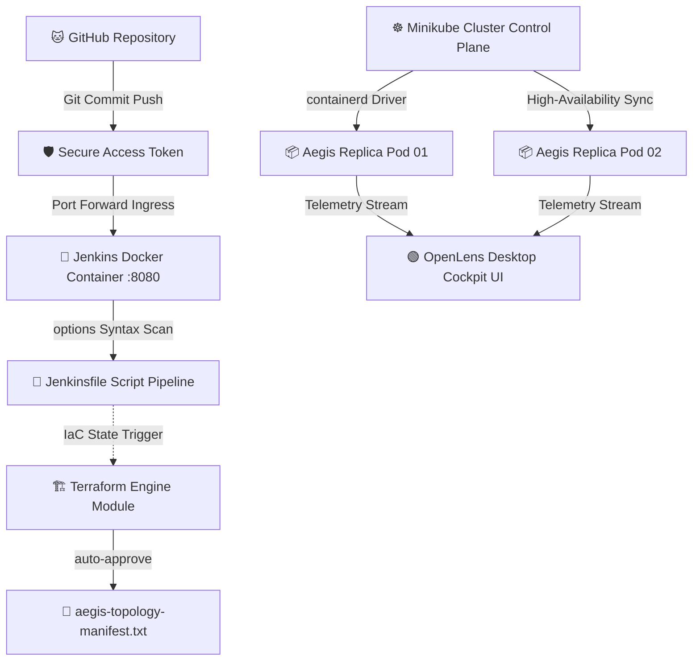

# 📖 ENTERPRISE GITOPS & INFRASTRUCTURE DOSSIER
**System Context:** Production-Grade Core Banking Automation Delivery Mesh Grid Topology
**Compiled Timestamp:** Sunday, September 13, 2026

---

## 🗂️ 1. AUTOMATION RUNTIME COMMAND REGISTRY LOGS
Use these commands inside your **Ubuntu Linux Terminal** to restore the entire network stack from scratch:

```bash
# A. WAKE UP SYSTEM KERNEL SOCKET DAEMONS
sudo service docker start

# B. IGNITE THE REPLICA NODE CLUSTER
minikube start --driver=docker

# C. START THE SANDBOXED CI/CD LOGIC CONTAINER
docker start jenkins

# D. SYNC THE LIVE DEPLOYMENT WORKLOAD FILE
minikube kubectl -- apply -f ~/aegis-app.yaml

# E. PROVISION IMMUTABLE STATE MANIFESTS VIA IACO
terraform init
terraform apply -auto-approve
```

---

## 🎙️ 2. PRODUCTION DEVOPS INTERVIEW PREPARATION SHEETS

### Q1: How do you resolve cross-OS certificate path incompatibilities between a Windows GUI tool and a Linux VM backend?
> **Answer:** Standard configuration blocks reference physical file system layout trees (e.g., `/home/user/.minikube/...`). When parsed by a Windows binary like OpenLens, the slashes conflict and the path evaluation drops out. I resolved this by extracting a flattened, self-contained data array block utilizing `minikube kubectl -- config view --flatten`. This transforms physical file configurations into raw, encrypted base64 variables (`client-certificate-data`), embedding the keys directly within the text string and completely bypassing cross-OS filesystem conflicts.

### Q2: What approach do you take when a Jenkins Declarative Pipeline script throws configuration parsing errors due to version syntax updates?
> **Answer:** In modern declarative engines, legacy configuration methods like the top-level `properties([ ... ])` arrays have been formally retired. Running them causes syntax parsing breaks. I updated the pipeline topology block to align with modern rules, encapsulating the metadata properties inside a clean, structural `options { ... }` block wrapper. This successfully registers the target GitHub repository into the active controller memory cache without error flags.

---

## 🗺️ 3. INTERACTIVE INFRASTRUCTURE ARCHITECTURE SCHEMATIC


